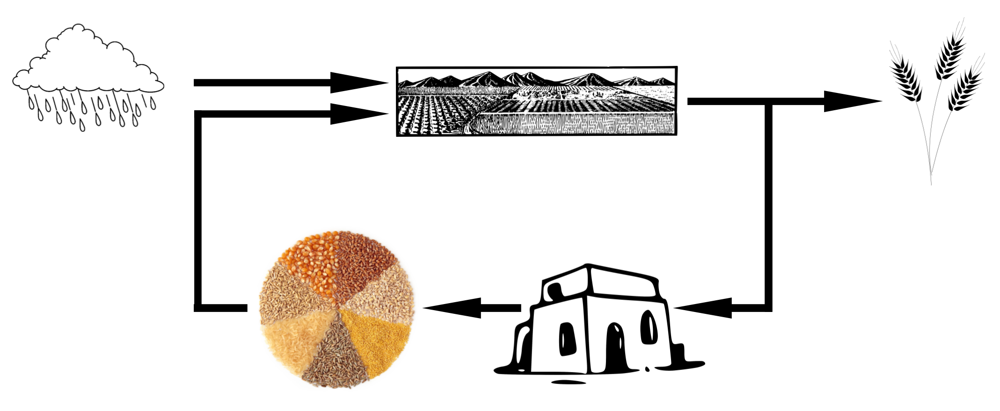
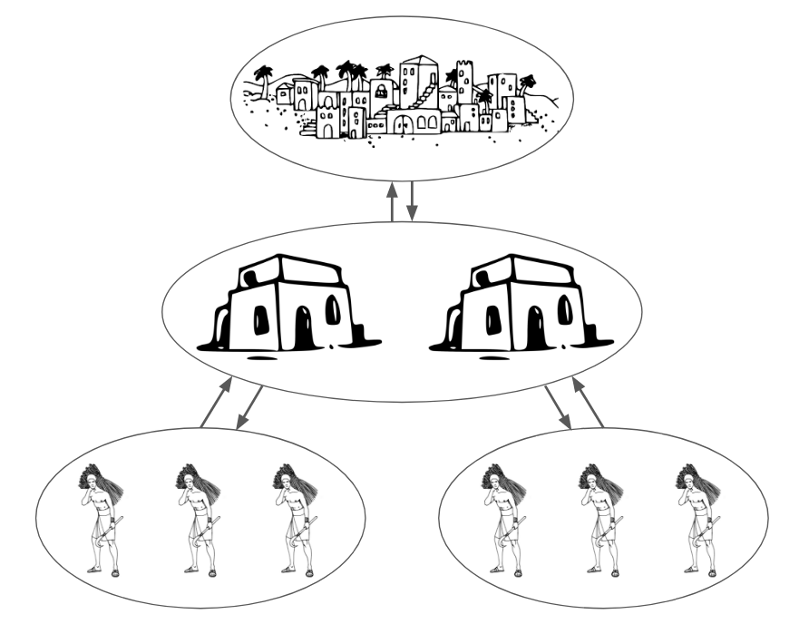
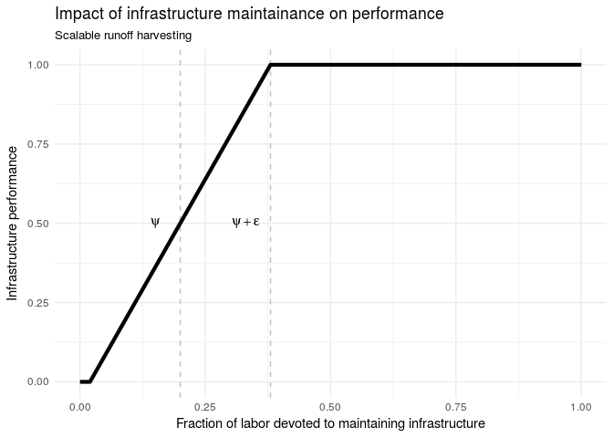
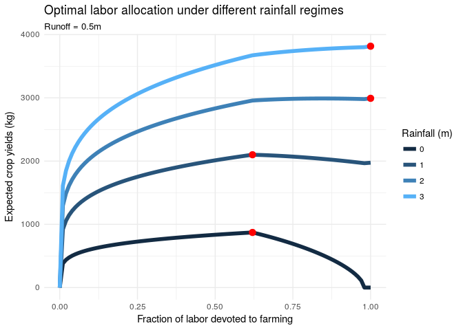
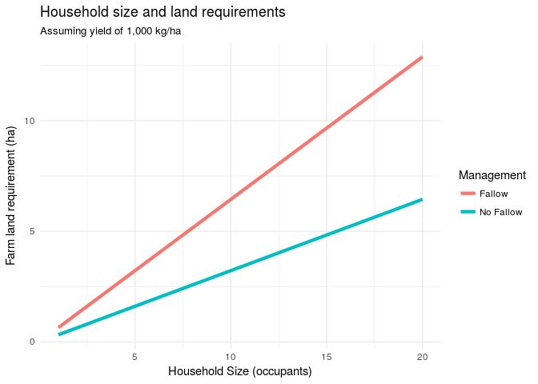
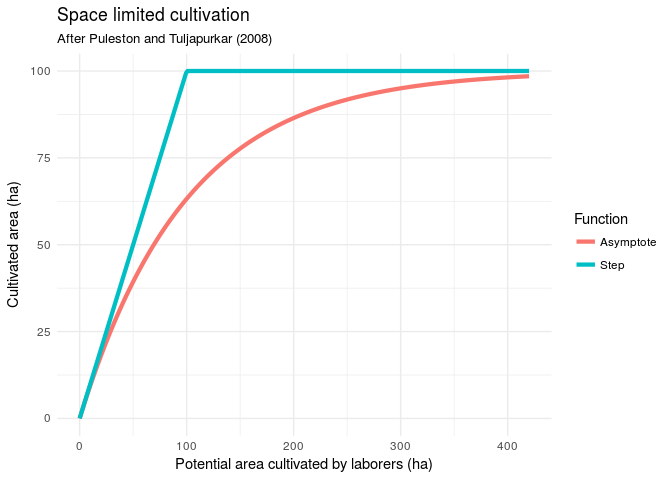
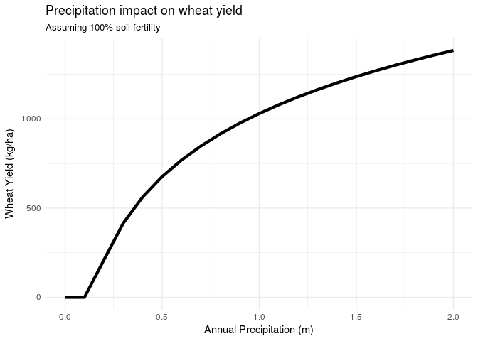
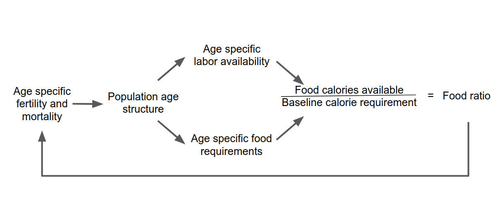
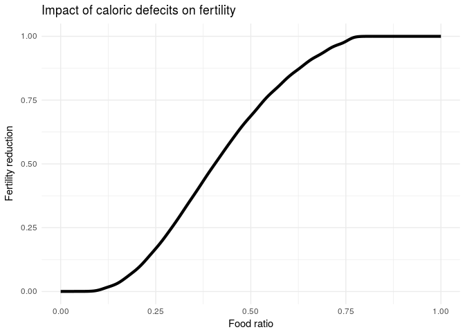
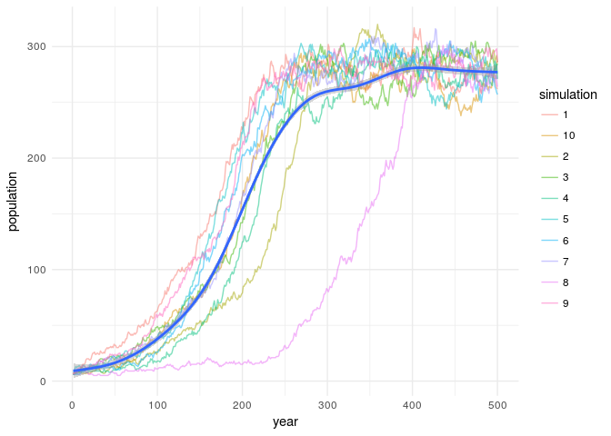

## Introduction
Earth system models are climate models capable of simulating land-atmosphere feedbacks, as well as the complex biogeochemical and biogeophysical processes that drive them. These models are particularly well-suited to studying the impact of preindustrial land use on regional climate change, as they explicitly resolve the impacts of irrigation, deforestation, and agropastoral production on the flow of water and energy between the land and atmosphere. Generating realistic maps of past land use is a difficult task, however, so paleoclimatologists often rely on static, coarse-resolution estimates derived from present-day conditions. 

This notebook examines agent-based modeling as an alternative to this static approach, presenting a model that can generate dynamic land-use maps that continuously contribute to and adapt to environmental variability. I use Roman North Africa as a case study here, because North Africa is a region of tight coupling between the land and atmosphere, and experienced massive agricultural expansion during the Roman Imperial period. The model simulates a population of agropastoral household agents using simple heuristics to allocate their labor to different activities in response to variable crop yields, from which complex spatial patterns of land use and land cover change may emerge. What follows is a scaled-down version of the full model, with emphasis on its basic conceptual and practical components.


## Setup
Before we begin, let's load some packages we'll need for this analysis. All of these packages are available on CRAN, so if you don't have any in your current R installation simply connect to the internet and run the command `install.packages("tidyverse")`.

```r
library(tidyverse)
```

```
## ── Attaching packages ────────────────────────────────── tidyverse 1.2.1 ──
```

```
## ✔ ggplot2 2.2.1     ✔ purrr   0.2.4
## ✔ tibble  1.4.2     ✔ dplyr   0.7.4
## ✔ tidyr   0.8.0     ✔ stringr 1.3.0
## ✔ readr   1.1.1     ✔ forcats 0.3.0
```

```
## ── Conflicts ───────────────────────────────────── tidyverse_conflicts() ──
## ✖ dplyr::filter() masks stats::filter()
## ✖ dplyr::lag()    masks stats::lag()
```

## Modeling framework

 

Here we'll use the tidyverse family of R packages to setup and run the model. The tidyverse is a set of R packages that share a common API, with a focus on using functional programming to make data analysis clear and human-readable. The basic idea of running a multi-agent simulation in the tidyverse is to represent our entire population of agents as a single data frame, with each agent getting its own row, and each column encoding different agent-specific variables. This framework allows us to take advantage of vectorized functions and underlying C++ code, which together facilitate extremely efficient processing of data frames with millions of rows.

Representing agents as rows in a data frame let's us use another powerful tool -- the nested data frames in the purrr package. In a nested data frame, the objects stored in one or more columns can themselves be data frames of an arbitrary size, and so on. So, for example, a data frame of "household" agents can contain columns with simple integer values such as the amount of food that household has or the number of occupants in it.


```r
households <- tibble(household_number = 1:3,
                     food_supply = 30,
                     n_occupants = 1:3)
households
```

```
## # A tibble: 3 x 3
##   household_number food_supply n_occupants
##              <int>       <dbl>       <int>
## 1                1         30.           1
## 2                2         30.           2
## 3                3         30.           3
```
 
We can also modify the "occupant" column, so each entry contains a new data frame containing a row representing and individual "person" agent and any relevant variables, such as age or sex.

```r
households_nest <- households %>%
  mutate(occupants = map(n_occupants, ~ tibble(occupant_number = 1:.x,
                                               age = round(runif(.x, 1, 40)))))
households_nest
```

```
## # A tibble: 3 x 4
##   household_number food_supply n_occupants occupants       
##              <int>       <dbl>       <int> <list>          
## 1                1         30.           1 <tibble [1 × 2]>
## 2                2         30.           2 <tibble [2 × 2]>
## 3                3         30.           3 <tibble [3 × 2]>
```

The occupants column is just a list of data frames.

```r
households_nest$occupants
```

```
## [[1]]
## # A tibble: 1 x 2
##   occupant_number   age
##             <int> <dbl>
## 1               1   38.
## 
## [[2]]
## # A tibble: 2 x 2
##   occupant_number   age
##             <int> <dbl>
## 1               1   31.
## 2               2   12.
## 
## [[3]]
## # A tibble: 3 x 2
##   occupant_number   age
##             <int> <dbl>
## 1               1   18.
## 2               2    5.
## 3               3   19.
```

We can easily unnest this data frame of 3 household agents into one of 6 occupant agents. This framework allows us to efficiently simulate "agents" across an arbitrary number of scales, all while facilitaing cross-scale interactions. For example, let's divide the households' food supplies across each individual in the household.

```r
unnest(households_nest) %>%
  mutate(individual_food = food_supply / n_occupants)
```

```
## # A tibble: 6 x 6
##   household_number food_supply n_occupants occupant_number   age
##              <int>       <dbl>       <int>           <int> <dbl>
## 1                1         30.           1               1   38.
## 2                2         30.           2               1   31.
## 3                2         30.           2               2   12.
## 4                3         30.           3               1   18.
## 5                3         30.           3               2    5.
## 6                3         30.           3               3   19.
## # ... with 1 more variable: individual_food <dbl>
```

This model uses purrr's nesting functions to create a multi-level social simulation, with individuals, households, and settlements continuously interacting. This allows us to isolate specific processes to the scales most relevant to their functioning, while ensuring computational efficiency.

## Parameters
Before we get into the model code, let's define some baseline parameters that will be used throughout the rest of the model. Beside the climate and environmental datal, these parameters are the only thing that make the model "Roman". Substitute in different parameters, and you will be well on your way to simulating the pre-Industrial agricultural system of your choice.

The model will only "see" a few of these parameters (such as the wheat requirement) but we include all the variables that go into their derivation (such as calorie requirement) to preserve sanity if we ever want to change something later.

Start with parameters directly related to food and food consumption.

```r
max_yield <- 1000 # baseline wheat yield, in kg/ha, should range from 1000 - 2000

calorie_req <- 2582 * 365  # annual individual calorie requirement
wheat_calories <- 3320 # calories in a kg of wheat
wheat_calorie_prop <- 1 # percent of individual's food calories coming from wheat
wheat_req <- calorie_req / wheat_calories * wheat_calorie_prop # kg of wheat to feed a person for 1 year
```

Next define parameters related to farming and agricultural labor.

```r
sowing_rate <- 135  # kg of wheat to sow a hectare (range 108 - 135 from Roman agronomists)
seed_proportion <- 135 / max_yield # proportion of harvest to save as seed for next year's sowing

labor.per.hectare <- 40 # person days required to farm a hectare
max_labor <- 280 # maximum days per year an individual can devote to farming

psi <- 0.2 # proportion of a household's labor needed to keep irrigation infrastructure at half capacity
epsilon <- 0.18 # the scalability of irrigation infrastructure

memory_length <- 10 #  number of years' crop yields a household remembers
```

Finally, import some demographic data for the Roman Empire that defintely aren't pulled from Wikipedia . . .

```r
# probability of a female giving birth at each age
# all agent's are "female", which means these values are halved at runtime
fertility_table <- tibble(
  age = 10:49,
  fertility_rate = rep(c(0.022, 0.232, 0.343, 0.367, 0.293, 0.218, 0.216, 0.134), each = 5)
) %>%
  .[-1:-2,] # 10 and 11 year olds can't give birth

# probability of an individual dying at each age
mortality_table <- tibble(
  age = 0:99,
  mortality_rate = c(0.381, rep(0.063, 4), rep(c(0.013, 0.010, 0.013, 0.016, 0.018, 0.020, 0.022, 0.024, 0.025, 0.033, 0.042, 0.062, 0.084, 0.122, 0.175, 0.254, 0.376, 0.552, 0.816), each = 5))
)
```

<!-- -->

## Functions
Now we can define all the functions that will be used in the simulation. The basic steps a houshold agent undergoes each (annual) time step are:

1. **Allocate time**  Decide how much time they will spend farming vs maintaining irrigation infrastructure.
2. **Allocate land**  Decide how much land they can need to farm, and get as much as is available.
3. **Farm**  Harvest food from their land.
4. **Eat** Consume some of the food they harvest, put the rest in storage.

Once a household has consumed the amount of food it has farmed or stored in that year, it calculates the ratio of the food it recieved to the needs of all its occupants. Then each occupant in turn:

1. **Reproduces** (Stochastically) creates a new individual agent in the same household.
2. **Dies** (Stochastically) deletes themselves from the household.

### Time Allocation
The first step a household agent takes is to allocate its labor between different farming activities. Here the options are to spend time farming or maintaining irrigation infrastructure. The amount of time spent farming constrains the amount of land a household can cultivate. The amount of time spent maintaing infrastructure determines the efficiency of irrigation, and thus the proportion of available runoff a household can direct to its fields.

The performance of infrastructure is piecewise linear function of labor inputs [@david2015effect]. Two parameters $\psi$ and $\epsilon$ determine how much labor is required to keep irrigaiton infrastructure working at maximum capacity. Here we parameterize $\psi \approx \epsilon$ to make the infrastructure scalable, that is the agents can spend more or less time maintaining infrastructure and still be assured of at least some water. This is the consistent with the traditional *wadi* based runoff harvesting practiced in the region.

```r
infrastructure_performance <- function(maintainance_labor, max_irrigation = 1){
  ifelse(0 <= maintainance_labor & maintainance_labor < (psi - epsilon), 0,
    ifelse(between(maintainance_labor, psi - epsilon, psi + epsilon), 
                   max_irrigation / (2 * epsilon) * (maintainance_labor - psi + epsilon), 
                   max_irrigation))
}
```

<!-- -->

Given knowledge of the irrigation system and simple heuristics for relative returns to labor farming and maintaining infrastructure, the housheolds solve a constrained optimization problem [@david2015effect] to determine of the proportion of available time they should devote to each activity so as to maximize their expected utility.

```r
allocate_time <- function(households){
  total_labor = 1; j = 0.2; k = 0.6
  households %>%   #calculate optimum values for the different regions of the step function
    mutate(r1_maintainance = 0,
           r1_utility = yield_memory * land ^ (1 - j - k) * total_labor ^ j * precipitation ^ k,
           r3_maintainance = psi + epsilon,
           r2_maintainance = pmin(pmax((1 / (j + k)) * (k * total_labor + j * (psi - epsilon) - 2 * j * epsilon * precipitation / runoff), 
                                       0), r3_maintainance),
           r2_utility = yield_memory * land ^ (1 - j - k) * (total_labor - r2_maintainance) ^ j * (runoff / (2 * epsilon) * (r2_maintainance - psi + epsilon) + precipitation) ^ k,
           r3_utlity = yield_memory * land ^ (1 - j - k) * (total_labor - psi - epsilon) ^ j * (runoff + precipitation) ^ k,
           max_utility = pmax(r1_utility, r2_utility, r3_utlity),
           farming_labor = if_else(max_utility == r3_utlity, 1 - r3_maintainance,
                                   if_else(max_utility == r2_utility, 1 - r2_maintainance, 1 - r1_maintainance))) %>%
    select(-(r1_maintainance:max_utility))  # remove all the temporary columns
}
```

<!-- -->


### Land Selection
Next the household agents decide how much land they need to farm. Households get enough land to feed all their occupants, plus some extra to sow their fields, based on their expected crop yields. A biennial fallow system is practiced, so the land requirement is doubled.

```r
calc_land_req <- function(n_occupants, yield, fallow = T){
  wheat_req * n_occupants * (1 + seed_proportion) / yield * ifelse(fallow, 2, 1)
}
```

<!-- -->

Having determined how much land they require, households divide the available land up among themselves. As households grow in size, they can't acquire an unlimited amount of land, but are limited by the available land. The maximum available land is constrained by the size of an environmental raster grid cell (typically 1km), the proportion of that grid cell with slopes < 5 degrees, and the land taken up by other households.

```r
allocate_land <- function(households){
  households %>% 
   mutate(land = calc_land_req(n_occupants, yield_memory),
          max_land = max_cultivable_land(laborers, farming_labor, area * arable_proportion * 100, fallow = T, type = 'asymptote')) %>%
    mutate(land = pmin(land, max_land)) %>%
    select(-max_land)
}
```

These space constraints are either introduced as a sudden ceiling on land expansion, or by requiring increasing amounts of labor to decreasing amounts of land as the limit of available land is approached [@puleston2008population].

```r
max_cultivable_land <- function(laborers, farming_labor, available_area, fallow = T, type = 'asymptote'){
  potential_area <- max_labor * farming_labor * laborers * ifelse(fallow, 2, 1) / labor.per.hectare
  if(type == 'unlimited') return(potential_area)
  if(type == 'step') return(pmin(available_area, potential_area))
  if(type == 'asymptote') return(available_area * (1 - exp(-potential_area / available_area)))
}
```

<!-- -->

### Farming
Households then farm their land and harvest crops. They keep track of the yields from one year to the next in their memory.

```r
farm <- function(households){
  households %>%
    mutate(yield = climatic_yield,
           yield_memory = yield,
           harvest = land * yield * .5 - land * sowing_rate) # halve the yields to represent biennial fallow
}
```

Crop yields are determined by rainfall and soil fertility. The climatic potential yield (determined by precipitation) is calculated separately from successive local yield reduction factors. This allows the climatic potential yield to be easily substituted by potential yields from the crop model component of an Earth System Model in future simulations.

```r
calc_climatic_yield <- function(precipitation){
  max_yield * pmax(0, 0.51 * log(precipitation) + 1.03)  # annual precipitation impact on yields
}

calc_yield_reduction <- function(fertility, climate_yield){
  climate_yield * pmax(0, 0.19 * log(fertility / 100) + 1)  # fertility impact on yields
} 
```


<!-- -->

### Eating and storage
Finally, the households consume the harvested food. If they harvested more food than they require this year, they add the remainder to their storage. If they did not have enough food this year, they remove some food from storage. Any food that is not consumed after two years in storage is destroyed. The households update their food ratio, the ratio of food consumed to food required, as an index to use later in the demographic submodel.

```r
eat <- function(households){
  households %>%
    mutate(total_cal_req = n_occupants * wheat_req,
           food_ratio = pmin(1, (storage + harvest) / total_cal_req),
           old.storage = storage,
           storage = if_else(total_cal_req <= storage, harvest, pmax(harvest - (total_cal_req - old.storage), 0))) %>%
    select(-old.storage, -total_cal_req, -harvest)
}
```

### Demography
Now the model "agents" shift to the individual occupants of all the households. All individuals have intrinsic, age-specific fertility and mortality rates. As is standard practice in population biology, we treat all individuals as female, and halve the per capita fertility rates accordingly. As a household's food supply drops, and its resulting food ratio drops below 1, the fertility rates of the household's occupants will also drop. These age specific fertility and mortality profiles alter the age composition of the occupants in the household, which in turn impacts food production and feeds back into fertility rates. We can call this basic process "food-limited demography" [@puleston2014invisible].


To estimate the response of fertility to food stress, we can fit a nonlinear function to some toy data representing a sigmoidal functional response between the food ratio and the proportional reduction in fertility rates.

```r
fertility_elasticity <- read_csv('data/fertility_data.csv', skip = 1) %>% 
  rename(food_ratio = X, fertility_reduction = Y) %>%
  mgcv::gam(fertility_reduction ~ s(food_ratio, k = 35), family = mgcv::betar(eps = 0.0001), dat = .)
```

<!-- -->

We then unnest the households data frame to get a table of all the occupant agents, calculate the age and food-specific fertility rates for each individual, and run a random bernoulli trial to determine which individuals give birth. We then sum the number of births in each household, and add a new occupant of age 0 for each brith.

```r
calculate_births <- function(households){
  households %>%
    unnest(occupants) %>%
    left_join(fertility_table, by = 'age') %>%  # find the fertility rate corresponding to age
    mutate(fertility_rate = if_else(is.na(fertility_rate), 0, fertility_rate),
           fertility_reduction = mgcv::predict.gam(fertility_elasticity, ., type = 'response'),
           baby = rbernoulli(n(), fertility_rate / 2 * fertility_reduction)) %>%  # divide by two to make everyone female ...
    group_by(settlement, household) %>%
    summarise(births = sum(baby)) %>%
    .$births
}

give_birth <- function(occupants, births){
  if(births > 0 %% !is.na(births)) occupants <- add_row(occupants, age = rep(0, births))
  return(occupants)
}

reproduce <- function(households){
  households %>%
  mutate(births = calculate_births(.),
         occupants = map2(occupants, births, give_birth)) %>%
    select(-births)
}
```

Death procedes in a similar fashion. We calculate the age specific mortality rates (mortality is not sensitive to food stress here, but could easily be introduced as with fertility above), and then draw a random number to determine if each individual lives or dies. All individuals that do not die then age by one year.

```r
die <- function(households){
  households %>%
    unnest(occupants) %>%
    inner_join(mortality_table, by = 'age') %>% # inner join has the effect of killing off all those over 99
    mutate(survive = rbernoulli(n(), (1 - mortality_rate))) %>%
    filter(survive == T) %>%
    mutate(age = age + 1) %>% # happy birthday!
    select(-survive, -mortality_rate) %>%
    nest(age, .key = occupants)
}
```

For convenience, we can wrap the birth and death processes up in a helper function that will also recalculate the number of occupants and labor availability of each household afterwards.

```r
birth_death <- function(households){
  households %>%
    reproduce %>%
    die %>% 
    mutate(n_occupants = map_int(occupants, nrow),
           laborers = map_dbl(occupants, ~filter(.x, between(age, 15, 65)) %>% nrow))
}
```

### Convenience functions
Before running the simulation, we define two simple convenience functions that combine all the dynamics presented above. We also include some simple environmental processes here, such as the rainfall and irrigation, which would otherwise be handled using rasters.

```r
# this function takes a settlement (tibble of households), and makes the households do what they need to do
household_dynamics <- function(settlements){
  unnest(settlements) %>%
    allocate_time %>%
    allocate_land %>%
    farm %>%
    eat %>%
    birth_death %>%
    nest(household:last(everything()), .key = households) %>%
    mutate(population = map_dbl(households, ~ sum(.$n_occupants)))
}

# this function takes the master dataframe and calculates the per patch climatic yields from per patch precipitation and irrigation
environmental_dynamics <- function(settlements){
  settlements %>%
    mutate(total_land = map_dbl(households, ~sum(.$land)),
           total_maintainance = map_dbl(households, ~ sum(1 - .$farming_labor)),
           infrastructure_condition = infrastructure_performance(total_maintainance),
           irrigation_water = infrastructure_condition * runoff / total_land,
           irrigation_water = if_else(is.finite(irrigation_water), irrigation_water, 0), # catch a divide by zero error
           precipitation = 1,
           climatic_yield = calc_climatic_yield(precipitation + irrigation_water)) %>%
    select(-(total_land:irrigation_water))
}
```


## Simulation
With all the necessary functions defined, we can start running some simulations. Define two more functions, one for initializing the household agents and one for the occupant agents.

```r
create.households <- function(x){
  tibble(household = 1:x,
         n_occupants = init_occupants,
         storage = n_occupants * wheat_req, # start off with a year's supply of food
         yield_memory = max_yield, # fond memories
         land = calc_land_req(n_occupants, yield_memory),
         farming_labor = 1,
         food_ratio = 1) %>%
    mutate(occupants = map(n_occupants, create.occupants),
           laborers = map_dbl(occupants, ~filter(.x, between(age, 15, 65)) %>% nrow)) # 
}

create.occupants <- function(x){
  tibble(age = rep(25, x)) # occupants start off at age 25
}
```

Create a single household with 6 people.

```r
init_settlements <- 1 
init_households <- 1
init_occupants <- 6

agents <- tibble(settlement = 1:init_settlements,
                     x = 1, y = 1,
                     households = init_households) %>%
              mutate(households = map(households, create.households))
```

Make an environment data frame, and join it with the agent data. For now we'll keep it to dummy valus to keep things simple.

```r
environment <- tibble(x = 1, y = 1, area = 1, arable_proportion = 1, precipitation = 1, runoff = .2)
sim_data <- left_join(agents, environment)
```

We run the actual simulation using the *accumulate* function from purrr. Under the hood its doing the same thing as a for loop, but saving all the intervening steps for us to make plotting and analysis easier later.

```r
run_simulation <- function(input_data, nsim, replicates = 1){
  rerun(replicates, {
     tibble(year = 1:nsim) %>%
      mutate(data = accumulate(year, ~ household_dynamics(environmental_dynamics(.x)), .init = input_data)[-1],
             population = map_dbl(data, ~sum(.$population))) %>%
      select(-data)}) %>%
    bind_rows(.id = 'simulation')
}
```


```r
# This code (not run), presents an alternative parallelized approach for those with multiple cores
library(parallel)
run_simulation_par <- function(input_data, nsim, replicates = 1){
  mclapply(1:replicates, function(x, input_data, nsim){
     tibble(year = 1:nsim) %>%
      mutate(data = accumulate(year, ~ household_dynamics(environmental_dynamics(.x)), .init = input_data)[-1],
             population = map_dbl(data, ~sum(.$population))) %>%
      select(-data)
  }, input_data = input_data, nsim = nsim, mc.cores = detectCores() - 1) %>%
    bind_rows(.id = 'simulation')
}
```

Run a 500 year simulation with 4 replicates.

```r
nsim <- 500
replicates <- 10

sim_results <- run_simulation(sim_data, nsim, replicates)
```


## Analysis
The accumulate function leaves our simulation outputs in a tidy format, with each year in its own row, which makes plotting in ggplot a breeze.

```r
ggplot(sim_results, aes(year, population)) +
  geom_line(aes(color = simulation), alpha = .5) +
  geom_smooth() +
  theme_minimal()
```

```
## `geom_smooth()` using method = 'gam'
```

<!-- -->


```r
sim_results %>%
  filter(year == nsim) %>%
  ggplot(aes(x = population)) +
  geom_density(fill = 'grey') +
  labs(x = 'Population', title = 'Distribution of equilbrium population') +
  theme_minimal()
```

<!-- -->


## References

